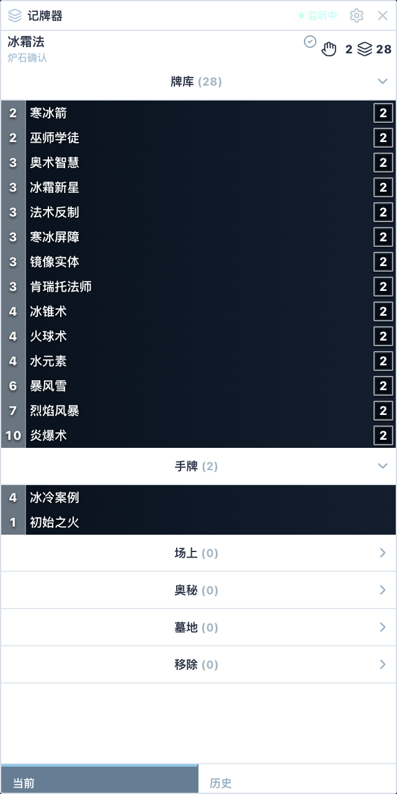
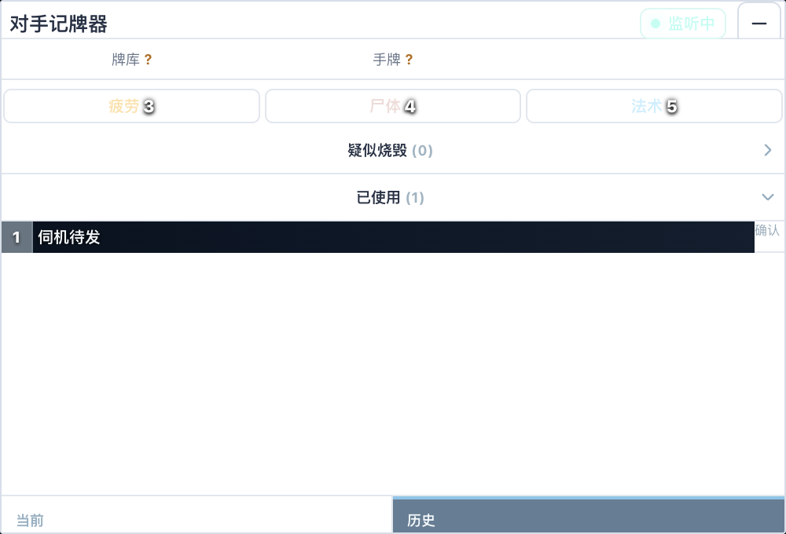

# 炉石 Mac 记牌器

**v0.5.7 · Apple 芯片 Mac · 本机运行**

自动识别当前套牌，在对局中显示牌库变化、对手已出牌、竞技场选牌数据和关键计数。

[下载公开版](https://github.com/jackotom/lscs-mac-jpq/releases/latest) · [查看 v0.5.7 更新](docs/releases/v0.5.7.md)


_当前桌面版的隔离演示界面；不会读取或展示你的真实对局数据。_

## 能做什么

- 自动读取炉石日志，识别当前构筑套牌、本机收藏套牌和竞技场牌库。
- 对局中同步显示我方剩余牌库、手牌、场面、墓地与对手已使用卡牌。
- 独立显示双方场攻、奥秘候选和关键卡牌计数；游戏内置顶，不抢操作焦点。
- 竞技场三选一显示抽到影响、对套牌影响、选取率和高胜选取率。
- 本机保留最近 100 局结果，首页集中显示战绩、资讯、热门卡组和竞技场排行。

## 实际界面

### 实时对局工作台


牌库变化、事件流和对手行动集中在一个页面，数据不完整时会明确提示，不用占位数据冒充结果。

### 游戏内悬浮窗

| 我方牌库 | 对手已出牌 |
| --- | --- |
|  |  |
| 显示剩余牌库、手牌和公开计数。 | 显示疲劳、尸体、法术次数和已使用卡牌。 |

悬浮窗截图单独拍摄；实际使用时会置顶显示在炉石对局画面上。

## 下载与安装

当前公开安装包支持 Apple 芯片 Mac。

1. 打开[最新发布页](https://github.com/jackotom/lscs-mac-jpq/releases/latest)，下载 Mac ARM64 压缩包。
2. 解压后，把“炉石记牌器”拖入“应用程序”。
3. 首次打开若被 macOS 拦截，进入“系统设置 → 隐私与安全性”，选择“仍要打开”。

当前安装包已有开发签名，但未附带苹果公证票据，因此首次打开可能出现安全提醒。

## 第一次使用

1. 打开记牌器，点一次“修复日志”。
2. 完全退出炉石，再重新打开炉石。
3. 进入一局，记牌器会自动开始监听。

竞技场选牌或构筑模式画面识别需要“屏幕录制”权限。授权后重新打开记牌器即可；应用只在本机处理识别结果。

## 隐私边界

- 主要读取炉石日志；授权后可临时识别炉石窗口文字。
- 不读取游戏内存，不注入游戏进程。
- 对局记录和缓存保存在本机，不上传你的对局数据。

## v0.5.7 重点更新

- 对手记牌器“已使用”历史现在显示卡图。
- 图源加载失败时按备用源继续尝试；全部失败时仍保留卡名文字。
- 原有回合、确认状态和列表滚动保持不变。

完整历史见 [CHANGELOG.md](CHANGELOG.md)。

## 已知限制

- 炉石日志格式可能随游戏版本变化，遇到新格式时需要更新解析规则。
- 对手职业、手牌数和回合等信息取决于日志公开程度，无法确认时会显示未知。
- 首页公开统计受数据源可用性影响；版本不一致或数据过期时不会显示旧数据冒充当前结果。

更多实现和数据来源见 [docs/technical-notes.md](docs/technical-notes.md)。

## 许可与商业授权

本项目采用 [PolyForm Noncommercial License 1.0.0](LICENSE)：允许个人学习、研究、测试及其他许可中规定的非商业用途。

任何商业使用，包括销售、收费服务、企业内部业务使用、商业产品集成或以营利为目的的修改与分发，都必须事先取得项目版权所有者单独签发的书面商业授权。版权所有者及商业授权方为 GitHub 用户 [@jackotom](https://github.com/jackotom)。商业授权请发送邮件至 [admin@acyg.me](mailto:admin@acyg.me)，也可通过该 GitHub 账号联系。

这是一份“源码可见、非商业使用”的许可，不属于允许商业使用的开源许可。

本许可只覆盖项目版权所有者有权许可的内容。第三方依赖、炉石传说名称、卡牌图片及其他暴雪或网易资产不在本许可范围内；第三方组件继续遵循各自许可，详见 [THIRD_PARTY_NOTICES](THIRD_PARTY_NOTICES)。

<details>
<summary>源码运行与验证</summary>

```bash
npm install
npm run dev
```

生成当前 README 截图：

```bash
npm run screenshots:readme
```

完整发布验证：

```bash
npm run verify:release
```

</details>
